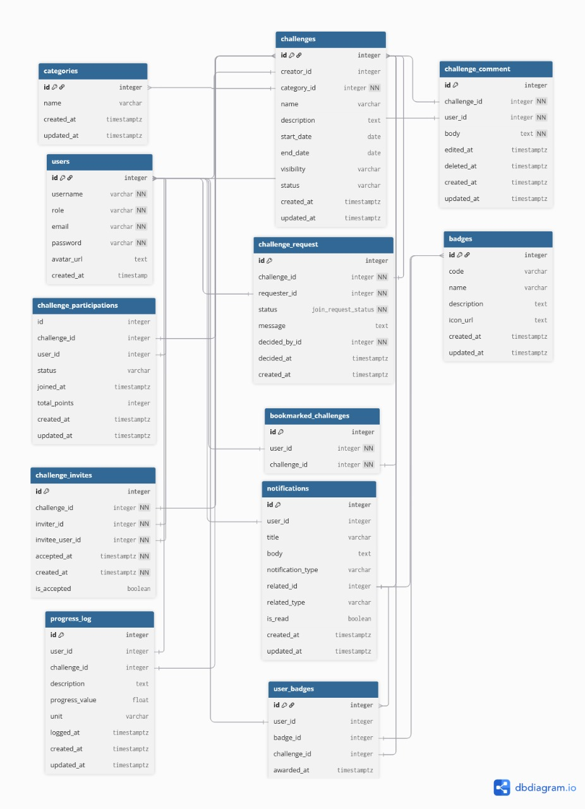

# Web Technologies Assignment


---

### Group Members
- Juan Cabello  
- Sebastian Letelier  
- Enzo Palavicino  

---

### Entities Diagram


---


### Test User Credentials

For testing purposes, you can log in with the following admin account:

- **Admin user**  
  - **Email:** `admin@example.com`  
  - **Password:** `Admin123!`

---

### Roles and Permissions

The application uses **CanCanCan** for authorization. The main roles and abilities are:

#### Guest (not signed in)
A user who is not logged in can:

- Read public data:
  - `Category`
  - `Challenge`
  - `ChallengeParticipation`
  - `ProgressLog`
  - `Badge`
  - `UserBadge`
  - `ChallengeComment`
  - `Notification`

#### Authenticated User (regular user)
In addition to all guest permissions, a signed-in user can:

- **Profile**
  - Read their own user profile (`User`)
  - Update their own user profile

- **Challenges & Participation**
  - Create `ProgressLog` entries for challenges they are participating in

- **Comments**
  - Create `ChallengeComment`
  - Update and destroy their **own** comments

- **Bookmarks**
  - Create, list, and delete their own `BookmarkedChallenge`
  - Toggle bookmark status for challenges they have bookmarked

- **Notifications**
  - Mark their own `Notification` records as read

- **User Badges**
  - Read their own `UserBadge`
  - Destroy their own `UserBadge`
  - Create `UserBadge` **only** for themselves (the `user_id` must match their own)

- **Requests & Invites**
  - Create `ChallengeRequest`
  - Create `ChallengeInvite`

#### Creator
A **creator** user (`user.creator? == true`) can:

- Create new `Challenge`
- Update and destroy challenges they created (where `creator_id` matches)

#### Admin
An **admin** user (`user.admin? == true`) can:

- `manage :all` – full access to all resources and actions

---

## Installation & Setup Guide

Follow these steps to run the fitness challenges Rails application locally.

### 1. Prerequisites

Make sure you have:

- Ruby and Bundler installed  
- PostgreSQL running  
- Node.js / JS runtime  
- Yarn (depending on Rails version)

### 2. Install Ruby dependencies

```bash
bundle install
```

### 3. Set up the database

```bash
rails db:create
rails db:migrate
rails db:seed
```

### 4. Start the Rails server

```bash
bin/dev
```

Visit:

```
http://localhost:3000
```

